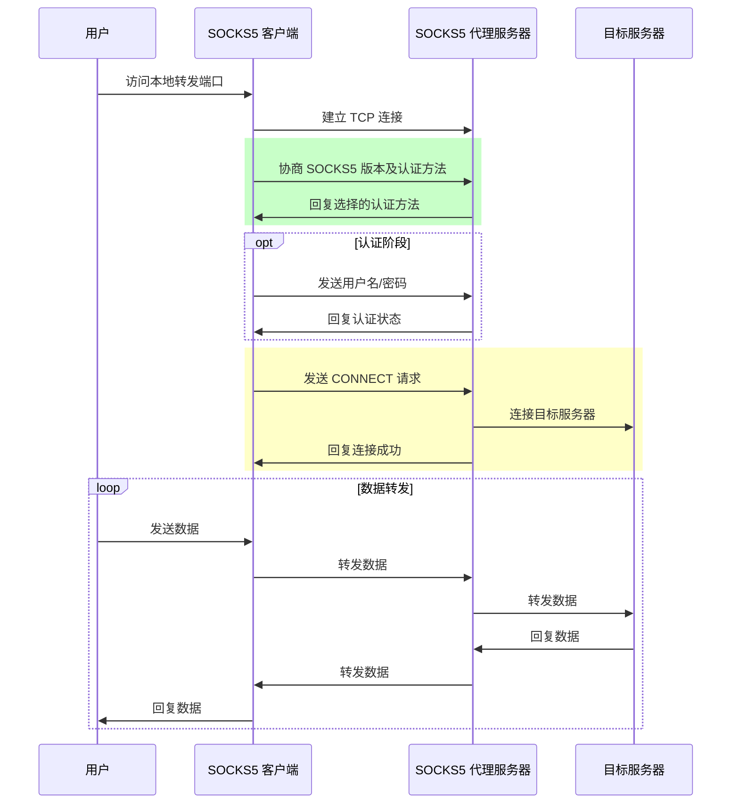

# SOCKS5 客户端数据转发工具

一个功能完整的 SOCKS5 客户端，支持本地端口转发到远程服务器，并提供桌面应用界面。

## 功能特性

### 核心功能
- ✅ **TCP 端口转发**：将本地 TCP 端口流量通过 SOCKS5 代理转发到远程服务器
- ✅ **UDP 端口转发**：支持 UDP 数据的转发，实现 SOCKS5 UDP ASSOCIATE 功能
- ✅ **多规则支持**：可以同时配置多个转发规则
- ✅ **认证支持**：支持 SOCKS5 用户名/密码认证

### 配置管理
- ✅ **配置文件**：从 JSON 配置文件加载代理信息和转发规则
- ✅ **命令行参数**：支持通过命令行参数覆盖配置文件设置
- ✅ **动态规则**：支持在配置文件中定义多个启用/禁用状态的规则

### 界面支持
- ✅ **命令行工具**：轻量级的命令行客户端
- ✅ **桌面应用**：基于 Web 技术的 GUI 界面，可打包为桌面应用

## 架构设计

### 代码结构
```
├── cmd/
│   ├── client/       # 命令行客户端
│   ├── gui/          # 桌面应用
│   ├── myproxy/      # 原始测试程序
│   └── server/       # SOCKS5 服务器实现
├── doc/              # 文档目录
├── internal/         # 内部包
│   ├── config/       # 配置管理
│   ├── proxy/        # 端口转发核心逻辑
│   └── socks5/       # SOCKS5 协议实现
├── ui/               # 桌面应用 HTML/JS/CSS
├── config.json       # 默认配置文件
└── README.md         # 项目说明文档
```

### 协议流程



## 快速开始

### 前提条件
- Go 1.25.4 或更高版本
- SOCKS5 代理服务器（可以使用项目自带的服务器）

### 编译项目

```bash
# 编译命令行客户端
go build ./cmd/client

# 编译 SOCKS5 服务器
go build ./cmd/server

# 编译桌面应用（需要额外依赖）
go build ./cmd/gui
```

### 使用命令行客户端

#### 启动单个转发规则
```bash
# TCP 转发
./client -proxy 127.0.0.1:1080 -local 127.0.0.1:8080 -remote example.com:80 -proto tcp

# UDP 转发
./client -proxy 127.0.0.1:1080 -local 127.0.0.1:5353 -remote 8.8.8.8:53 -proto udp
```

#### 从配置文件启动
```bash
./client -config ./config.json
```

### 启动桌面应用

```bash
go run ./cmd/gui/main.go
```

### 使用自带的 SOCKS5 服务器

```bash
# 启动 SOCKS5 服务器（默认监听 0.0.0.0:1080）
./server
```

## 配置文件格式

### 基本配置

```json
{
  "proxyAddr": "127.0.0.1:1080",
  "username": "",
  "password": "",
  "forwardRules": [
    {
      "id": "default-tcp",
      "enabled": true,
      "protocol": "tcp",
      "localAddr": "127.0.0.1:8080",
      "remoteAddr": "example.com:80"
    },
    {
      "id": "dns-udp",
      "enabled": false,
      "protocol": "udp",
      "localAddr": "127.0.0.1:5353",
      "remoteAddr": "8.8.8.8:53"
    }
  ]
}
```

### 配置字段说明

| 字段名 | 类型 | 描述 |
|-------|------|------|
| `proxyAddr` | string | SOCKS5 代理服务器地址 |
| `username` | string | 认证用户名（可选） |
| `password` | string | 认证密码（可选） |
| `forwardRules` | array | 转发规则列表 |

#### 转发规则字段

| 字段名 | 类型 | 描述 |
|-------|------|------|
| `id` | string | 规则唯一标识 |
| `enabled` | boolean | 是否启用该规则 |
| `protocol` | string | 协议类型（"tcp" 或 "udp"） |
| `localAddr` | string | 本地监听地址 |
| `remoteAddr` | string | 远程目标地址 |

## 命令行参数

```
Usage of client:
  -config string
        配置文件路径 (默认 "./config.json")
  -local string
        本地监听地址 (覆盖配置文件)
  -password string
        认证密码 (覆盖配置文件)
  -proto string
        协议类型 (tcp/udp) (覆盖配置文件) (默认 "tcp")
  -proxy string
        SOCKS5代理服务器地址 (覆盖配置文件)
  -remote string
        远程目标地址 (覆盖配置文件)
  -username string
        认证用户名 (覆盖配置文件)
```

## 示例用法

### 示例 1: HTTP 代理转发

```bash
# 启动本地 8080 端口转发到 example.com:80
./client -proxy 127.0.0.1:1080 -local 127.0.0.1:8080 -remote example.com:80

# 测试访问
curl http://localhost:8080
```

### 示例 2: DNS 代理转发

```bash
# 启动本地 5353 端口 UDP 转发到 8.8.8.8:53
./client -proxy 127.0.0.1:1080 -local 127.0.0.1:5353 -remote 8.8.8.8:53 -proto udp

# 测试 DNS 查询
dig @127.0.0.1 -p 5353 example.com
```

### 示例 3: 从配置文件启动多个规则

1. 创建配置文件 `config.json`
2. 定义多个转发规则
3. 启动客户端

```bash
./client -config ./config.json
```

## 桌面应用

### 功能特性

- **代理配置**：直观的代理服务器配置界面
- **规则管理**：添加、编辑、删除转发规则
- **状态监控**：实时显示每个规则的运行状态
- **日志查看**：查看连接和转发日志

### 运行桌面应用

```bash
go run ./cmd/gui/main.go
```

### 界面预览

- 简洁的现代化设计
- 支持明暗主题切换
- 响应式布局，适配不同屏幕尺寸

## 开发指南

### 目录说明

- **`internal/socks5/`**: SOCKS5 协议实现，包含客户端和服务器逻辑
- **`internal/proxy/`**: 端口转发核心逻辑，处理 TCP 和 UDP 转发
- **`internal/config/`**: 配置管理，处理配置文件的加载和保存
- **`cmd/`**: 不同用途的可执行程序入口

### 扩展建议

- 添加 TLS 支持
- 实现 SOCKS5 BIND 命令
- 添加流量统计功能
- 支持多种代理协议（HTTP/HTTPS）
- 实现跨平台打包脚本

## 测试

### 单元测试

```bash
go test ./...
```

### 集成测试

1. 启动 SOCKS5 服务器
2. 配置并启动客户端
3. 使用 curl、dig 等工具测试转发功能

## 许可证

MIT License

## 贡献

欢迎提交 Issue 和 Pull Request！

## 联系方式

如有问题或建议，欢迎通过以下方式联系：

- 提交 GitHub Issue
- 发送邮件至项目维护者

---

**注意**：本项目仅供学习和研究使用，请勿用于非法用途。
